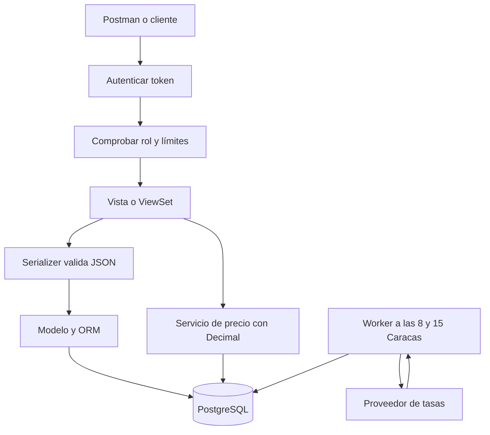

# Guía de defensa técnica

Para retomar Python y Django desde conocimientos de arquitectura. Léela con Swagger y el código abiertos. El objetivo es poder explicar y modificar lo entregado. Si te preguntan por herramientas utilizadas, explica con honestidad el apoyo de IA y qué revisaste y probaste personalmente.

## 1. Explicación en 90 segundos

> La solución es una API REST de inventario con Django y Django REST Framework. El modelo define los datos de los libros y sus restricciones; los serializers validan JSON y el ViewSet expone CRUD, búsqueda y stock bajo.
>
> El precio convierte el costo en dólares con una tasa guardada y aplica un recargo del 40 %, como en el ejemplo. Uso Decimal y redondeo al final. Un proceso independiente actualiza la tasa a las 8:00 y 15:00 de Caracas. Si el proveedor falla, conserva la última conocida, informa su antigüedad y reintenta. Pasadas 48 horas bloquea nuevos cálculos para no presentar un valor indefinidamente viejo.
>
> Agregué login con tokens revocables y dos roles: básico consulta; completo modifica el inventario y administra usuarios. Las sesiones vencen y se revocan al cambiar contraseña o permisos. Hay límites de peticiones y validación explícita de campos.
>
> Docker ejecuta la API, PostgreSQL y el actualizador. Incluí tests, Postman y documentación OpenAPI. La configuración cloud está preparada y debe verificarse con su URL pública para completar la entrega.

Adapta la última frase únicamente después de publicar y verificar la nube. No digas que está desplegado mientras falte ese paso.

## 2. Recorrido de una petición



Para calcular, la vista comprueba que existe el libro, lee la tasa persistida, bloquea la fila del libro y guarda el precio con su costo vigente. La red externa está en el proceso de sincronización.

| Pieza | En términos sencillos | Archivo |
| --- | --- | --- |
| Django | Base del backend: configuración, ORM, migraciones y usuarios. | `config/settings.py` |
| DRF | Herramientas REST: JSON, endpoints, permisos y errores. | `books/views.py` |
| Modelo | Esquema y reglas persistentes de una entidad. | `books/models.py` |
| Migración | Cambio versionado del esquema SQL. | `books/migrations/` |
| Serializer | Valida datos entrantes y construye respuestas. | `books/serializers.py` |
| ViewSet | Agrupa acciones del mismo recurso. | `books/views.py` |
| Servicio | Regla de negocio independiente del HTTP. | `books/services.py` |
| Autenticación | Identificar quién hace la petición. | `accounts/views.py` |
| Autorización | Decidir qué puede hacer esa persona. | `accounts/permissions.py` |
| Worker | Proceso separado que realiza tareas programadas. | `rates/management/commands/run_rate_scheduler.py` |

## 3. Python mínimo que debes reconocer

```python
from decimal import Decimal

multiplier = Decimal("1.40")
price = cost * rate * multiplier
```

`import` trae funciones/clases; `def` define una función; `class` define una clase; `self` es el objeto actual. Un diccionario es `{ "campo": valor }`. `None` representa ausencia de valor y se convierte en `null` en JSON. `with transaction.atomic()` crea una transacción; `try/except` captura fallos previstos; los decoradores como `@action` agregan comportamiento a métodos.

```python
Book.objects.filter(stock_quantity__lt=10)
```

Equivale conceptualmente a pedir libros donde stock sea menor que 10. `__lt` significa menor que y `__iexact` comparación exacta sin distinguir mayúsculas. El ORM parametriza valores; no se concatena SQL del cliente.

## 4. Los temas que más probablemente te preguntarán

### ¿Por qué Decimal?

Los números float representan fracciones binarias y pueden introducir pequeñas diferencias. Decimal trabaja con representación decimal, apropiada para dinero. Los importes viajan como cadenas y se redondean al final con HALF_UP.

### ¿40 % de margen o de recargo?

Es recargo sobre costo según el ejemplo: `15.99 × 0.85 × 1.4 = 19.03`. Un margen del 40 % sobre el precio de venta se calcularía dividiendo el costo entre 0.6 y daría otro resultado. Conservé `margin_percentage` por compatibilidad con el enunciado y documenté la interpretación.

### ¿Por qué no consultar la tasa en cada request?

Porque el proveedor abierto publica una vez al día. Aumentar llamadas añade latencia y puntos de fallo sin dar más precisión temporal. Persistir permite compartir la misma tasa entre workers y sobrevivir reinicios. Las consultas a las 8 y 15 verifican disponibilidad; no crean dos publicaciones del proveedor.

### ¿Por qué la última tasa conocida tiene límite?

Continuidad no significa aceptar valores viejos indefinidamente. Conservo la última cotización, la identifico como `last_known` cuando corresponde y devuelvo su edad. Al superar 48 horas respondo 503 sin reemplazar el precio. Ese umbral es una decisión configurable que acordaría con negocio.

### ¿Qué pasa si todavía no hay ninguna tasa?

Se permite un respaldo explícito de arranque, 0.85 para reproducir el ejemplo EUR. La respuesta marca `fallback` y advierte que no es una cotización actual. Se puede desactivar con `ALLOW_CONFIGURED_RATE_FALLBACK=false`. Después de existir una cotización guardada, un valor fijo no disimula su vencimiento.

### ¿Por qué no usar Celery y Redis?

Hay una tarea periódica pequeña. Un comando de Django separado, con estado y concesión en PostgreSQL, resuelve esa necesidad sin dos servicios adicionales. Si crecieran las tareas, las colas, la concurrencia y los reintentos complejos, evaluaría una cola especializada. No lancé hilos de fondo dentro de Gunicorn porque se duplicarían o terminarían al reiniciar workers.

### ¿Cómo evitas actualizadores duplicados?

Un estado por moneda se bloquea en transacción y asigna una concesión por 2 minutos. Otro proceso ve que está ocupada y no consulta. La red ocurre fuera de la transacción. Si un proceso muere, la concesión vence; si perdió la concesión, no reemplaza el resultado de otro proceso.

### ¿Qué protegen los tokens y por qué no JWT?

El token identifica una sesión. Knox guarda su digest y permite revocarla borrando el registro. Para una API pequeña prefiero esa revocación inmediata y simple. JWT también sería válido, pero necesitaría decidir duración, revocación y rotación; no es obligatorio para un login REST.

### ¿Cómo distingues permisos?

Básico consulta; completo modifica libros y administra cuentas. La autorización se ejecuta en el backend. Un básico que llame manualmente a POST /books recibe 403 aunque se salte cualquier interfaz. Cambiar roles revoca tokens. No se aceptan `is_superuser` ni otros campos internos desde JSON.

### ¿No es demasiado poder para el rol completo?

Es una simplificación deliberada para dos niveles. Full permite también crear otros full y restablecer contraseñas ajenas; solo se asigna a personas de confianza. En un sistema más grande separaría operador de inventario y administrador de usuarios.

### ¿Qué diferencia hay entre 401, 403 y 429?

401: no hay una sesión válida. 403: la sesión es válida, pero el rol no tiene permiso. 429: se alcanzó un límite; normalmente se devuelve Retry-After. Los límites se comparten por base de datos entre workers, aunque no sustituyen un WAF.

### ¿Cómo evitas SQL injection?

Uso consultas parametrizadas del ORM, nunca concateno entradas para construir SQL. Además valido los datos de negocio. Validar un ISBN no es por sí mismo una defensa de SQL injection: son controles distintos.

### ¿Por qué validar en serializer y base de datos?

El serializer genera errores claros para el cliente. Las restricciones SQL también protegen ante carreras y otros escritores. Por ejemplo, dos POST simultáneos no pueden crear dos libros con el mismo ISBN porque la base impone UNIQUE; se traduce el conflicto esperado a 400.

### ¿Qué pasa si cambia el costo mientras calculas?

El servicio vuelve a leer el libro con `select_for_update` dentro de una transacción. Espera si otra actualización tiene la fila bloqueada y usa el costo confirmado. Los updates HTTP usan ese mismo bloqueo. La prueba con dos conexiones PostgreSQL comprueba que el cálculo usa el costo nuevo.

### ¿Por qué no SQLite en producción?

La prueba exige base gestionada y se utilizan bloqueos de fila de PostgreSQL. SQLite es práctico para aprender, pero no tiene las mismas garantías de concurrencia. La configuración rechaza SQLite en producción.

### ¿Qué guardarías en auditoría?

Actor, instante, tipo de operación, entidad e información necesaria sobre los cambios. Nunca contraseñas ni tokens. Una auditoría completa aún no está implementada; la priorizaría junto con backups probados, alertas y MFA administrativo.

### ¿Qué hace Docker y qué hace Gunicorn?

Docker empaqueta dependencias y ejecución. Compose coordina los tres servicios locales. Gunicorn sirve Django con workers; `runserver` es solo para desarrollo. La base tiene un volumen para persistir y la imagen ejecuta con usuario sin root.

## 5. Demo de 10 minutos

1. Abre README y `/docs`. Explica los tres procesos y la diferencia entre configuración preparada y nube verificada.
2. Haz GET /books sin token: 401. Inicia sesión como completo y usa Authorize.
3. Crea un libro con ISBN válido y consulta su ID. El precio comienza en null.
4. Calcula el precio. Señala tasa, origen y antigüedad; compáralo con la fórmula.
5. Modifica el costo y muestra que invalida el precio. Prueba stock bajo y filtro por categoría.
6. Crea un usuario básico e inicia sesión con él. Consulta libros y demuestra un 403 al intentar crear.
7. Vuelve al completo; cambia el rol o desactiva el básico. Su token previo debe recibir 401.
8. Ejecuta Collection Runner: comprueba que las 38 peticiones pasan. Solo elimina su libro temporal y deja su usuario temporal inactivo.
9. Muestra un test de tasa caída y otro de concurrencia. Finaliza con las limitaciones reales y las mejoras siguientes.

Comandos seleccionados:

```sh
docker compose exec web python manage.py test accounts.tests
docker compose exec web python manage.py test rates.tests.RateTests.test_provider_failure_preserves_last_known_rate_and_retries
docker compose exec web python manage.py test books.test_concurrency
```

Las pruebas simulan al proveedor y no dependen de su disponibilidad. PostgreSQL sí se usa de verdad para verificar los bloqueos.

## 6. Cambios pequeños para practicar

| Petición del entrevistador | Dónde empezar | Qué recordar |
| --- | --- | --- |
| Cambiar recargo a 35 % | `books/services.py` | Cambiar constante y resultados de tests del cálculo. |
| Añadir filtro por autor | `books/views.py`, serializer de consulta | Validar longitud y mantener paginación/permisos. |
| Hacer usuario operador sin administrar cuentas | `accounts/models.py` y permisos | Migración de choices, matriz de permisos y tests negativos. |
| Cambiar horarios de actualización | `config/settings.py` | Zona horaria explícita y tests de cambio de día. |
| No aceptar respaldo fijo | Variable de entorno | Sin historial devuelve 503 hasta sincronizar. |
| Añadir campo a Book | Modelo, migración, serializer | Compatibilidad con registros existentes y documentación. |

## 7. Plan de estudio breve

- 20 minutos: ejecutar login/CRUD desde Swagger y distinguir 400, 401, 403, 404 y 503.
- 25 minutos: seguir POST /books desde rutas hasta serializer, modelo y SQL.
- 20 minutos: seguir el cálculo y explicar el recargo, Decimal y bloqueo de fila.
- 20 minutos: seguir login, autorización y revocación de tokens.
- 15 minutos: simular fallo de tasas con tests y explicar el worker separado.
- 20 minutos: practicar la demo y hacer un cambio pequeño tú mismo.

No memorices una lista de herramientas. Debes poder responder: qué problema resuelve cada decisión, qué falla si la quitas y qué limitación queda.
